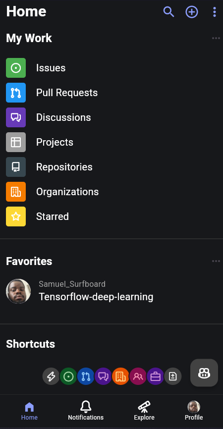
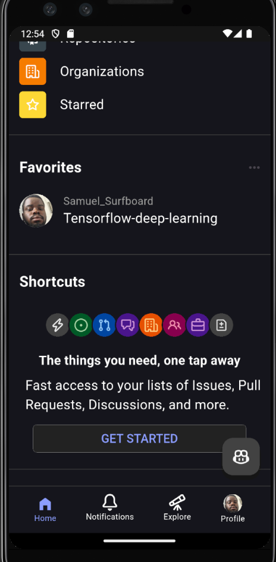

# Github UI Clone

This project is a Flutter application that aims to replicate the basic UI and some functionalities of the GitHub mobile app. 

## Features

This app demonstrates the following UI elements and functionalities, inspired by the GitHub mobile app:

-   **Header Section:**
    -   Displays the "Home" title prominently.
    -   Includes action icons for search, adding new content, and more options.

-   **"My Work" Section:**
    -   Shows a list of work-related items with icons and labels.
    -   Items include:
        -   Issues (with a green icon)
        -   Pull Requests (with a blue icon)
        -   Discussions (with a purple icon)
        -   Projects (with a gray icon)
        -   Repositories (with a dark blue-grey icon)
        -   Organizations (with an orange icon)
        -   Starred (with a yellow icon)
    - Has a "more" options button.

-   **"Favorites" Section:**
    -   Displays a list of favorite user or repository
    - The user has a profile picture

-   **"Shortcuts" Section:**
    -   Provides quick access to various GitHub features through circular icons.
    -   Includes shortcuts for:
        -   Notifications
        -   Issues
        -   Pull Requests
        -   Discussions
        -   Organizations
        -   People
        -   Briefcase
        -   File Diff

- **"Get Started"**
    - A button for fast access to the shortcuts

-   **Bottom Navigation Bar:**
    -   Mimics the GitHub bottom navigation with icons for:
        -   Home
        -   Notifications
        -   Explore
        -   Profile

- **Floating Button**
    - Has the github copilot icon

## UI Design

-   **Color Palette:** The app uses a dark theme with a background color of `Color.fromARGB(255, 23, 24, 27)`.
-   **Icons:** Utilizes icons from `Icons` and `OctIcons` packages, and also FontAwesome.
- **Layout**: The layout is achieved through the use of Column, rows and padding.
- **Containers**: The section of "my work" and "shortcuts" has container to place the icons.

## Screenshots

<!-- Insert screenshots here -->
<!-- To insert an image: -->
<!--  -->
<!-- For example: -->
Screenshots of the home screen's UI, more to be added later





## Packages Used

-   `font_awesome_flutter`
-   `icons_plus`

## Getting Started

1.  **Clone the repository:**
    ```bash
    git clone <repository-url>
    ```
2.  **Navigate to the project directory:**
    ```bash
    cd learn
    ```
3.  **Install dependencies:**
    ```bash
    flutter pub get
    ```
4.  **Run the app:**
    ```bash
    flutter run
    ```

## Future Improvements

-   Add more features and functionalities.
-   Implement state management for a more dynamic UI.
-   Connect to the real github API.
-   Add more screens.

## Contributing

Feel free to contribute to this project by opening issues or submitting pull requests.

